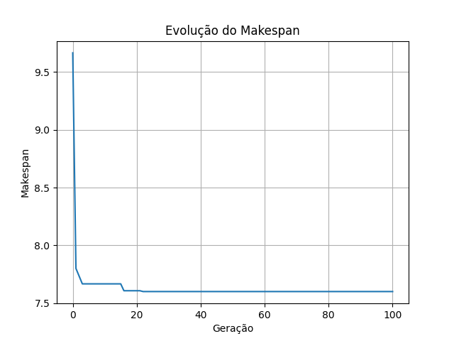
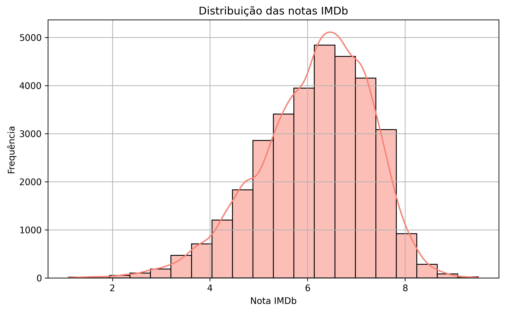
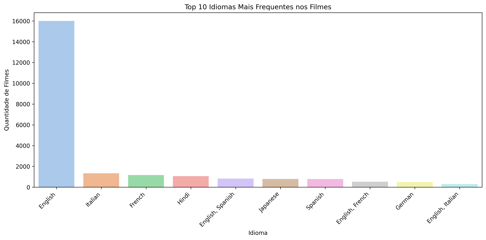

# :computer: Repository-AI 

Esse repositório é voltado para a matéria Inteligência Artificial, do curso de Ciência da Computação. Durante o curso serão realizados exercícios e trabalhos com foco em algoritmos de importância para a área e temas como machine learning...

---

# 📌 Problemas trabalhados 
## - 1) Alocação de tarefas em máquinas paralelas (Parallel Machine Scheduling)

  **Descrição:** 

  
                Suponha que você tenha m tarefas com tempos de
          processamento diferentes. E tenha n máquinas idênticas 
          (ou seja, qualquer tarefa pode ser executada em qualquer 
          máquina). O objetivo é distribuir as tarefas entre as 
          máquinas de forma que a máquina com maior carga de trabalho, 
          isto é, a máquina que termina por último (makespan) tenha 
          o menor tempo possível (minimizar o makespan).
          

  - O problema apresenta três níveis de dificuldade que devem ser resolvidos. 
  - Utilizei um algoritmo do tipo Memetico para a solução do problema proposto.

## O que é um algoritmo Memetico?

 - Um algoritmo memético é uma técnica de otimização que combina algoritmos genéticos (evolução populacional) com busca local (refinamento individual).

📌 Estrutura básica:

  1. População inicial é gerada.
  
  2. Seleção, cruzamento e mutação são aplicados.
  
  3. Cada indivíduo é melhorado com uma busca local.
  
  4. Repete-se até convergir ou atingir um critério de parada.

---
## :chart_with_downwards_trend: Evolução do Makespan


   

## - 2) Modelo de recomendação de filmes personalizado

  **Descrição:** 

        Nesse trabalho foi desenvolvido um algoritmo para recomendação de filmes 
        baseada nas caracteristicas preferidas pelo usuário. Através de um algo-
        ritmo de associação (baseado em Apriori, chamado MaxEclat) e uma
        base de dados ( Base de dados do IMdB ) com mais de 30 mil filmes. Inici-
        almente os dados foram pré-processados para retirar erros ou partes indesejadas
        como :

          - Colunas extras ( premiações , locais de gravação ...)
          - Dados incoerentes
          - Dados em branco 

📌 Estrutura básica:

  1. Dados passam por um pré-processamento.
  
  2. Análise dos dados obtidos na busca de erros ou incoerencias.
  
  3. Os dados são fornecidos ao algoritmo de associação (MaxEclat) para aprendizado.
  
  4.  ....

## :chart_with_downwards_trend: Resultados do processamento 

  

---

  
  

---

  


# 🛠️ Tecnologias utilizadas

```
  Python 3.x

  NumPy – para operações numéricas

  random – para geração de números aleatórios

  time – para medição de tempo de execução

  Matplotlib – para geração de gráficos

  collections.defaultdict – para estruturas de dados flexíveis
```

## ▶️ Como usar

   


